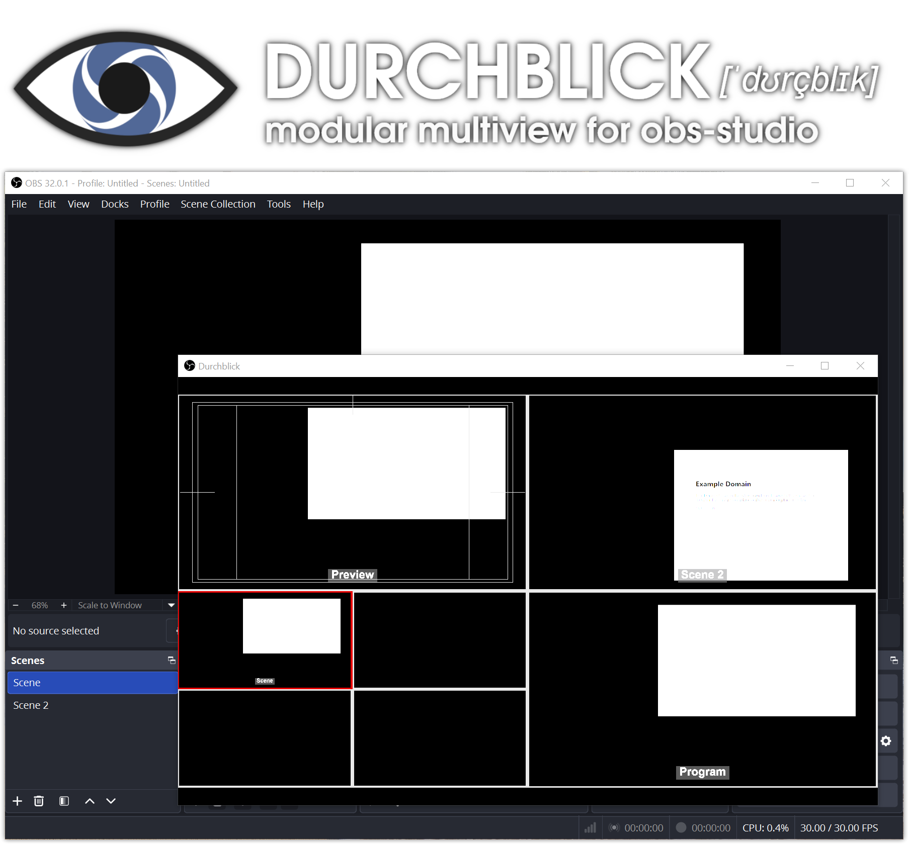

[placeholder.png](https://commons.wikimedia.org/wiki/File:SMPTE_Color_Bars_16x9.svg) licensed under [CC BY-SA 3.0](https://creativecommons.org/licenses/by-sa/3.0/deed.en)

## Build with GitHub Actions

Open the repository's **Actions** tab, select **Dispatch**, then choose
**Run workflow**. The workflow builds Linux x86_64, Windows x64, and a macOS
universal binary in parallel. Choose `RelWithDebInfo` for normal testing or
`Release` for distribution. Finished archives are available in the workflow's
**Artifacts** section.

Pull requests targeting `main` or `master` are built automatically. Every
branch push also builds all supported platforms.
